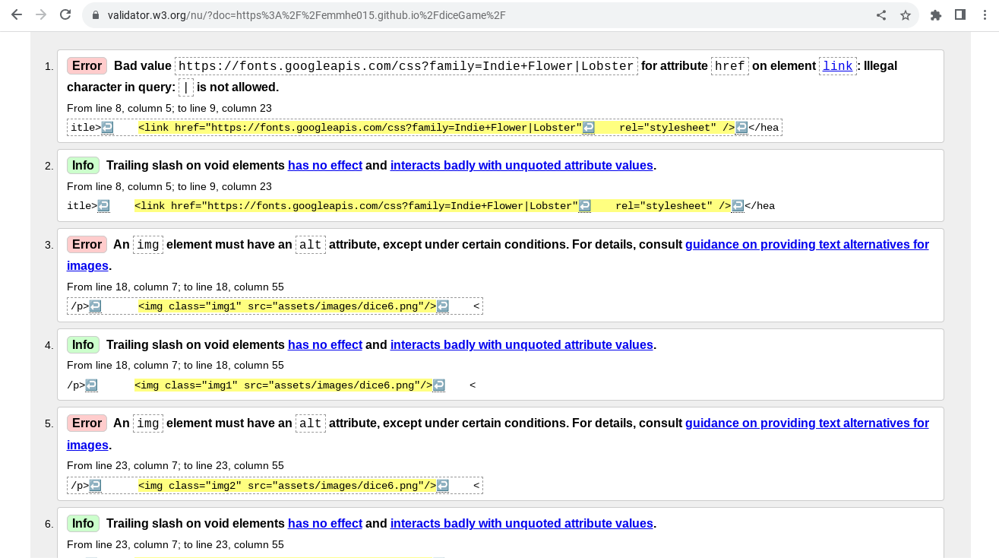

# READ ME
### Dice game

This is a game run by simple JavaScript. The user reload the page to see which player wins. 

### Content
- **Header**, depending on which player wins, the text in h1 changes.Run by JavaScript. 
- **Images**, run by JavaScript. When the user reload the page, a random dice image appears.
- **Player 1 & Player 2**, indicates which dice belongs to who.  

### Testing
When I first inserted the images, they didn't show at the page. I fixed it by adding "assets" in the variabel randomImageSource.

- **HTML test**, [v3 validator](https://validator.w3.org/nu/) got following result;

Fixed the errors and got this result;

- **CSS testing** [W3C CSS validator](https://jigsaw.w3.org/css-validator/) 
got this result;
  - Error with google font link (not working)
  Got a new link, and got this result;
  

- **Javascript Testing** [JShint](https://jshint.com/)
  - No errors 

- **Lighthouse testing**

### Deployment
The site was deployed to GitHub pages. The steps to deploy are as follows:
- In the GitHub repository, navigate to the Settings tab
- From the source section drop-down menu, select the Master Branch
- Once the master branch has been selected, the page will be automatically refreshed with a detailed ribbon display to indicate the successful deployment.

### Credits
- The structure to the overall code and the dice images are from a course on [Udemy](https://www.udemy.com/course/the-complete-web-development-bootcamp/?couponCode=KEEPLEARNING)
- The text from the Deployment section is from [This README example](https://github.com/Code-Institute-Solutions/readme-love-maths/blob/master/README.md)